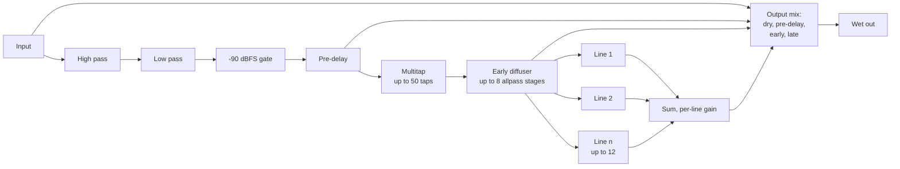
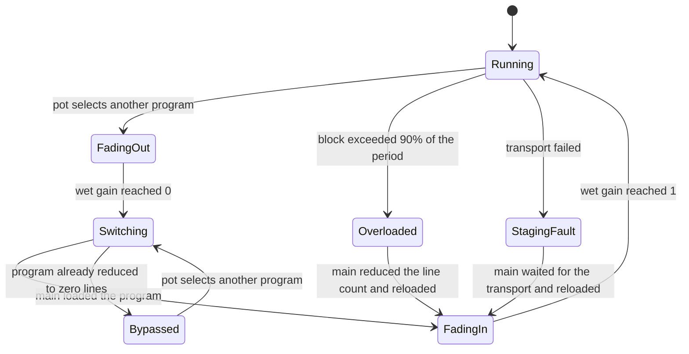

# cloudseed-daisy technical reference

| Field | Value |
|---|---|
| Status | Current. Supersedes every earlier review, performance and capture document in this directory (see [Document history](#document-history)). |
| Scope | The cloudseed-daisy library: the ported reverb kernel, the Daisy Seed engine around it, the memory staging, the build, and the evidence for both its correctness and its cost, measured on its reference application, the Löwenzahnhonig's Cloud Seed firmware. |
| Applies to | The reference firmware built against this revision with ARM GCC 16.2.0: default image CRC-32 `1588b43c`, profiling image `6ea1ef49`, unstaged image `a3bc1261`; the bare-Seed example `7be2d590`. |
| Hardware | Electro-Smith Daisy Seed (STM32H750IB), on the Löwenzahnhonig module, 48 kHz, 48-sample blocks. |
| Last updated | 2026-09-12 |
| Audience | Anyone changing this library. It states what the code does and why; the usage is in [README.md](README.md), the module in the reference firmware's README. |

Every quantitative claim below carries one of these labels.

| Label | Meaning |
|---|---|
| **Measured** | Recorded on the module with the profiling build, from a named capture. |
| **Host-verified** | Established by a test on a desktop host. It constrains numerical behavior, not target timing. |
| **Static** | Read out of a linker map, a disassembly listing or a build artifact. |
| **Modeled** | Calculated from an explicit model. Not an observation. |
| **Unmeasured** | Believed, but with no evidence of either kind. Stated as such wherever it appears. |

> **The current build has not run on hardware.** The most recent capture
> (`captures/hardware-baseline8.log`) measures image `623fe82a`, which predates
> the tenth program and the corrections made in the final audit. Everything
> under [Measured performance](#measured-performance) describes that image. The
> present code differs from it by one added program, three correctness fixes,
> one kernel optimization, a linker change, the round-11 changes (the
> transport inlined into the list builder, the one-pole filters without
> floating-point compares) and the extraction into this library (the
> firmware's callback and main-loop logic became the engine), and is
> host-verified only.

## Contents

- [Scope and reading order](#scope-and-reading-order)
- [The system](#the-system)
- [Signal flow](#signal-flow)
- [Fidelity contract](#fidelity-contract)
- [Real-time architecture](#real-time-architecture)
- [Memory architecture](#memory-architecture)
- [The MDMA transport](#the-mdma-transport)
- [DSP kernels](#dsp-kernels)
- [Numerical decisions](#numerical-decisions)
- [Optimization history](#optimization-history)
- [Measured performance](#measured-performance)
- [Resource budget](#resource-budget)
- [Build configuration](#build-configuration)
- [Verification](#verification)
- [Defects found and corrected](#defects-found-and-corrected)
- [Lessons learned](#lessons-learned)
- [Limitations and open work](#limitations-and-open-work)
- [Document history](#document-history)
- [Sources](#sources)

## Scope and reading order

This is a reference document with explanatory sections, not a tutorial and not
a how-to guide.[^diataxis] It records the system as it stands and the evidence
behind it. It deliberately does not record proposals that were never
implemented, nor the intermediate state of any implementation that was later
replaced.

Read [The system](#the-system) and [Signal flow](#signal-flow) for what the
firmware is. Read [Real-time architecture](#real-time-architecture) and
[Memory architecture](#memory-architecture) before changing anything that runs
in the audio callback. Read [Lessons learned](#lessons-learned) before
optimizing anything.

## The system

The library targets the Electro-Smith Daisy Seed. Its processor is an
STM32H750IB: a Cortex-M7 with a double-precision floating point unit and 16 KB
each of instruction and data cache.[^device] The reference application is the
Löwenzahnhonig, a Eurorack module built on the Seed, whose firmware runs the
core at 480 MHz where the silicon supports it, which is revision V or X only;
older revisions lack the required operating point and stay at 400
MHz.[^errata] Every measurement in this document was taken on that module.

The audio runs in stereo at 48 kHz in blocks of 48 samples, so one callback
period is 1 ms. That period is the deadline for everything the reverb does.

| Memory | Size | Use in this firmware |
|---|---:|---|
| Flash | 128 KB | The whole image. The binding constraint on the profiling build. |
| DTCM | 128 KB | Engine and reverb objects, sine table, staging windows, stack. Zero wait states, not cached. |
| ITCM | 64 KB | Staging windows only. Enabled and memory-tested at boot. |
| AXI SRAM | 512 KB | 448 KB delay-memory pool, staging plan, transport object. |
| D2 SRAM | 288 KB | libDaisy's audio DMA buffers, the MDMA descriptor list, a 232 KB delay pool. |
| SDRAM | 64 MB | Worst-case delay memory for every program, 15,974,400 B reserved. |

The reverb is a port of Cloud Seed, Valdemar Erlingsson's algorithmic reverb
(MIT license), from the plugin's C++ sources.[^legacy] The kernel lives in
`src/cloudseed/`; the engine in `src/cloudseed_daisy/` owns its memory, its
staging and its recovery on the Seed; the reference firmware (`cloudseed.cpp`
in the Löwenzahnhonig repository's `src/cloudseed`) maps the module's controls
onto the engine. Ten programs ship: the plugin's nine factory programs, and
one adapted from the MIT-licensed core of its successor, Ghost Note Audio's
Cloud Seed 2.[^core]

| # | Program | Lines per channel | Character |
|---:|---|---:|---|
| 0 | Small Room | 3 | Short delays, 21 early taps, no feedback low-pass by default. |
| 1 | Medium Space | 3 | 26 taps, 7 early and 5 late stages, mild modulation, low shelf. |
| 2 | Noise in the Hallway | 8 | 50 taps at zero gain, 3 early stages, one late stage, no modulation. |
| 3 | Hyperplane | 9 | 8 late stages per line, strong line modulation, every filter enabled. |
| 4 | Rubi-Ka Fields | 4 | No early reflections in the output, 6 heavily modulated stages per line. |
| 5 | Through the Looking Glass | 12 | 50 taps, 8 early and 8 late stages, long delays. The heaviest program. |
| 6 | The 90s Are Back | 9 | One early tap, 5 early stages, no late diffusion, deep modulation. |
| 7 | Dull Echoes | 12 | 70 ms pre-delay, input low-pass, no late diffusion, tap after the delay. |
| 8 | Chorus Delay | 12 | Taps over half a second, few stages, deep modulation, no interpolation. |
| 9 | Dark Plate | 12 | Adapted from the successor: no early reflections, 4 interpolated stages per line, 4.8 s decay. |

Line counts are the programs' own (the `Program` table the firmware hands the
engine), capped by the build's `CLOUDSEED_MAX_LINES` and reducible at runtime
by the overload guard.

In the reference firmware, Pot 1 selects the program in ten zones of equal width, with a quarter-zone of
hysteresis at each boundary so that a pot resting near a boundary does not flip.
Pot 2 is an equal-power dry/wet crossfade, Pot 3 the decay time with CV 1 added,
Pot 4 the cutoff of the low-pass filter in each line's feedback path. CV 2
freezes the reverb, with separate on and off thresholds at 0.55 and 0.45. The
LED is lit while frozen and flashes while the reverb is overloaded or bypassed.
Pot readings are smoothed with a 20 ms slew; libDaisy's default of 2 ms
computes a coefficient of exactly 1 at a 1 kHz callback rate, which is no
smoothing at all.

## Signal flow

Each channel runs independently with its own seeded random parameters, cross-fed
by the cross-seed value.



Each late line is an independent feedback loop: a modulated delay, a chain of up
to eight modulated allpass stages, and the damping filters (low shelf, high
shelf, first-order low-pass). The late-stage tap parameter swaps the order of
the delay and the diffuser, which also moves the output tap.

Two properties of the original are preserved deliberately because changing them
would change every preset's sound:

- **Block feedback.** The damping filters write into the feedback buffer for the
  *next* block, so a line's loop carries one block of extra latency. This is the
  plugin's block algorithm. `TestBlockFeedback` in the regression suite pins it
  with an independent impulse sequence.
- **The decay definition.** A line's feedback coefficient is
  `10^(-3 · delay / decay)` using the nominal, unrounded delay. The decay
  control is therefore a definition, not a broadband RT60 guarantee once
  diffusion, damping, modulation and the block feedback are included.

Freeze blocks new input and clears the input filters' state on entry, so notes
played during a hold cannot enter the tail on release. What is already in the
pre-delay and the early reflections still joins the held tail. During the hold
the line feedback approaches unity and damping is bypassed, but the modulation
and its fractional interpolation keep running; linear interpolation is a
frequency-dependent filter and a time-varying allpass does not conserve energy
the way a fixed one does, so a frozen tail decays slowly rather than holding
exactly.[^interp][^allpass] Host-verified: a Medium Space tail held for 1.75 s
loses 1.49 dB.

The reference firmware mixes the dry signal itself, so `DryOut` is forced to
zero in the reverb after every load (the engine's load hook) and the tone pot
always drives the feedback low-pass. Long decays can
build the wet signal well past full scale, so it passes a soft clip before the
mix; the dry path is untouched.

## Fidelity contract

The port is compared against the plugin's own C++ kernel, corrected for
portability and lifetime problems and for the same defects the port fixes
(`test/prepare_reference.py`). The reference is therefore deliberately
corrected legacy code, not an unmodified plugin binary.

| Condition | Result | Label |
|---|---|---|
| Modulation off, nine factory programs | Difference 82 to 147 dB below the reference signal | Host-verified |
| Modulation off, Dark Plate | 131.7 dB below the signal | Host-verified |
| Modulation on | Envelope comparison only: deterministic phase histories differ, largest envelope deviation 3.22 dB | Host-verified |
| All 414 factory parameter values and their positions | Match the checkout exactly | Host-verified |

The remaining difference with modulation off comes from the response-curve
quantization (4001 entries) and single-precision coefficients; it is not a
structural difference.

Deliberate deviations from the legacy code, each of which changes the sound and
each of which is intentional:

- The one-pole filters test the magnitude of their state, not its sign, so a
  negative tail is no longer truncated. The high-pass also clears its internal
  accumulator when it settles.
- `UpdateSeeds` refreshes every seeded setting, not only the delay lengths, so
  modulation depth and rate no longer depend on the order in which a preset
  sets its parameters.
- Freeze clears the input filters on entry rather than after they have processed
  the blocked input.
- Dark Plate's shelf gains are converted for the legacy filter's convention (see
  [Numerical decisions](#numerical-decisions)); its random generator differs
  from the successor's, so its delay and diffuser pattern is a documented
  variant of the successor's program, not a replica.

## Real-time architecture

The audio callback runs from the SAI DMA completion interrupt, above the main
loop.[^crackle] Anything that starves it cannot be recovered by main, so the
callback, not main, owns the decision to stop.



Ownership passes through one lock-free atomic state with acquire/release
ordering. The callback owns the reverb in `Running`, `FadingOut` and `FadingIn`;
main owns it in `Switching`, `Overloaded` and `StagingFault` and only then loads
presets, clears buffers or replans the staging. A `volatile` flag would not
order the surrounding non-atomic accesses, which is why the state is
`std::atomic` with a compile-time lock-free assertion.

**Overload recovery.** The callback measures its own block, and above 90% of the
period it zeroes the wet gain and publishes `Overloaded` immediately, so the
next callback takes the dry path and main gets to run. Main then reduces that
program's line count by one and reloads. Limits are remembered per program for
the power cycle, so revisiting a heavy program does not retry a count that
already failed; a program reduced to zero lines stays bypassed until another is
selected. The measurement is of the block just rendered, so the first overlong
block can still be audible: this is recovery, not prevention.

**Staging-fault recovery** is a separate path. A transport that fails may still
own its destination memory, so main waits for it to stop before it reloads onto
the CPU ring paths, and the fault never reduces the line count.

**What the load figure includes.** `CpuLoadMeter` runs from
`Engine::BeginBlock()` to `Engine::EndBlock()`, the first and last calls of
the application's callback, so the application's control processing and
mixing are inside the interval. libDaisy's `InternalCallback` converts the
SAI's integers to floats before that point and back afterwards, so those
conversions, the interrupt entry and exit, and any profiling overhead lie
outside it.
The 10% reserve is an engineering policy that covers them; it is not a measured
bound for them.

## Memory architecture

A twelve-line program touches far more delay memory than the 16 KB data cache
holds. Every allpass stage reads at one position and writes at another, every
delay line reads two adjacent positions and writes one, and the multitap reads
once per active tap. Each such stream advances one sample per sample and so
touches a new 32-byte cache line every eight samples. The memory system, not the
arithmetic, is the cost.

Three mechanisms address it, in order of how much they save.

**Per-program placement.** `LoadPreset` returns every buffer to the SDRAM
backing store, then `PlaceBuffers` collects the buffers the loaded preset
actually processes, sorts them by memory streams per float, and gives each a
cache-line-aligned slice of the internal pools: 448 KB of AXI SRAM first, then
232 KB of D2 SRAM behind libDaisy's DMA buffers. What does not fit stays in the
SDRAM. Static, from the inventory: five of the ten programs place every buffer
in internal RAM, and only Through the Looking Glass leaves a large share (93 of
its 236 rings) in the SDRAM.

**State in the DTCM.** The reverb object (filter state, block buffers, LFO
state), the 16 KB sine table and the engine object with the callback's buffers
are placed in `.dtcmram_bss`, which is neither cached nor subject to wait
states, so per-sample state never competes with the delay memory for the
cache. A constructor at priority 101 in the engine clears that section before
the objects placed there are constructed, because libDaisy's startup code
clears only `.bss`.

**Staging in the tightly coupled memories.** For every ring the loaded program
processes, the planner reserves a *window* — the samples the next block will
read, plus the modulation's excursion over the planning horizon — and a 48-float
*block buffer* in the TCMs. The kernels then read their window and write their
block, and a transport moves the samples between the TCMs and the ring while the
rest of the callback runs. Staging memory is the whole ITCM except its first 32
bytes (65,504 B, so that no buffer starts at the null address) plus 24 KB of
DTCM, 87 KB as the firmware reports it.

A ring is eligible only when its shortest delay, less the modulation spread,
clears the block still being written. Rings that fail that test keep the direct
ring path: two per program in eight of the ten, none in Dull Echoes and Chorus
Delay, and they are the short ones — a zero pre-delay and the shortest early
stage. Candidates are taken most expensive memory first — SDRAM, then D2,
then AXI — and within a tier the multitaps come last, because a staged allpass or
delay saves more per byte of staging memory than a tap window does. Memory tiers
are compared by physical address: they are separate allocations, and C++ does
not specify the result of relational comparisons between unrelated pointers.

Block buffers are shared. A head's block is written back within a few groups, so
the pool holds `kPools` (4) groups' worth of `kPoolBlocks` (2 + 8 = 10) buffers,
and a group reuses the buffers of the group four before it. That sharing is what
makes the largest program fit.

Static, from `test/inventory.cpp` at the firmware's line counts:

| Program | Lines | Staged / total rings | Tap windows | Worst-case copies per block | Staging memory |
|---|---:|---:|---:|---:|---:|
| Small Room | 3 | 44 / 46 | 40 | 208 | 24 KB |
| Medium Space | 3 | 52 / 54 | 50 | 252 | 27 KB |
| Noise in the Hallway | 8 | 40 / 42 | 0 | 116 | 15 KB |
| Hyperplane | 9 | 172 / 174 | 40 | 592 | 52 KB |
| Rubi-Ka Fields | 4 | 72 / 74 | 50 | 312 | 32 KB |
| Through the Looking Glass | 12 | 234 / 236 | 98 | 894 | 76 KB |
| The 90s Are Back | 9 | 30 / 32 | 0 | 86 | 13 KB |
| Dull Echoes | 12 | 36 / 36 | 34 | 172 | 21 KB |
| Chorus Delay | 12 | 108 / 108 | 34 | 388 | 37 KB |
| Dark Plate | 12 | 122 / 124 | 0 | 362 | 33 KB |

The copy figure is the planner's list budget, not a transfer count: it assumes
every window splits at a ring wrap. Placed rings are sized and positioned in
whole 48-sample blocks so that a write-back never splits.

**Ownership and cache discipline.** The CPU and the transport never touch a ring
at the same time. Main clears the rings and cleans the data cache before the
planner primes the first windows; when the staging is unplanned, the transport
must have stopped before the CPU reuses that memory, and the cache is cleaned
and invalidated so that stale lines cannot resurface. This is ownership
transfer, not coherency maintenance per sample, which would cost far more.[^cache]

## The MDMA transport

The Seed's master DMA moves the copies. Its descriptors are a linked list of up
to 1,000 nodes (40,000 B) in the D2 SRAM. `Init()` writes every constant field
and pre-links the whole chain once; `Copy()` then writes five words per node:
the bus select, the byte count, the two addresses and the link to the next
node, which `Commit()` cuts at a segment's last node and the next `Copy()` of
that node restores. The staging is a template on the transport's type, so
`Copy()` is inlined into the list builder instead of being called through a
virtual interface (see [DSP kernels](#dsp-kernels)).

The descriptor array is placed behind libDaisy's audio DMA buffers, at
`0x30004140` in the default image. libDaisy's MPU makes only the first 32 KB of
the D2 SRAM non-cacheable, so the array crosses out of that window at
`0x30008000` and most of it is cacheable. Cleaning each committed segment's
descriptors from the data cache is therefore necessary, not defensive.[^mdma]

**The list is streamed through the callback.** The reverb reports each group of
heads it has finished with — a channel's early section, then each of its lines —
through a per-reverb progress hook. The staging builds those entries' copies at
once and commits them as a segment whenever the channel is idle, so the copies
run while the rest of the block is processed and only the last segment runs
after it. A group waits only if the group four before it has not been written
back yet, because that is the group whose block buffers it is about to reuse.

Appending to a running list is not possible: the channel reads a node's
registers when it transitions to that node, its own registers are write-protected
while it is enabled, and a software request to a busy channel is ignored. Each
segment therefore restarts the channel at its first new node.[^mdma]

Two safety properties are load-bearing:

- **Every wait is bounded.** Waits are limited by a hardware timer that keeps
  advancing inside the audio interrupt, unlike SysTick, which a higher-priority
  callback can prevent from running.
- **A rejected commit still transfers ownership.** `Commit()` can discover a
  channel whose enable bit is unexpectedly set; it then marks itself failed and
  returns false. The staging reads `Idle()` after *every* attempted commit,
  including a rejected one, before returning the error, because recovery uses
  that state to decide whether to wait before freeing the windows.

## DSP kernels

Every optimization below preserves the arithmetic expression by expression and
its order, so the output stays bit-identical to the ring path. The regression
suite compares the two paths over every block size from 1 to 48 samples.

- **Local state and wrap-free segments.** The modulated allpass, modulated
  delay, biquad and one-pole filters copy coefficients, gains and indices into
  locals for a block and write the indices back afterwards. Circular-buffer
  loops run over segments that cannot wrap, so no loop body tests for a wrap.
  Static: the modulated allpass fell from 46 to 11 instructions per sample, the
  modulated delay from 69 to 9.
- **Multitap by tap, not by sample.** The block is written first, then each
  active tap adds its contribution to every output sample in one sequential run.
  The sum sees the same terms in the same order; the reads become six sequential
  cache lines per tap and block instead of one line per tap and sample. Taps
  with zero gain are packed out of the hot loop, which matters for Noise in the
  Hallway: it configures 50 taps at zero gain, so only its direct tap
  contributes and the module reports `taps=1`.
- **Staged run planning.** `PlanStagedRuns()` plans a block in one pass: the runs
  it splits into at the LFO updates, and the read position of every run,
  computed eight chains at a time. The per-run bookkeeping the kernels used to
  repeat is gone. The plan clamps by integer comparisons on the values' bit
  patterns and takes integer parts with `truncf` (`vrintz`), avoiding the
  floating-point compare and flag transfer that stall the pipeline.
- **Written-out runs.** A full eight-sample run of the allpass and the delay is
  written out with the offsets folded into the loads and stores; shorter runs
  keep a four-lane loop.
- **Filters in pairs.** Two lines' damping filters are interleaved
  (`ProcessFilterPair`) so that independent recursive filters expose
  instruction-level parallelism, and each filter's arithmetic is unchanged.
- **The delay's last run is reused.** The staged delay takes the final run's
  delay and interpolation gains from the plan instead of recomputing the same
  sine, modulation and gains at the end of the block; only the ring indices
  advance. Static: 660 → 524 bytes, 206 → 174 instructions.
- **Compare-free fade and mix loops.** The engine's program fade uses a step
  that is zero when idle and clamps by the bit pattern of the value; the
  reference firmware's dry/wet loop soft-clips through a bit-pattern
  comparison; neither loop contains a floating-point compare.
- **Cold ring paths.** In a staging build the ring paths serve only the few
  ineligible rings per program, so they are compiled for size; a build with
  `CLOUDSEED_STAGING=0` compiles them for speed instead and drops the staging
  entirely.
- **The transport inlined into the list builder.** The staging manager used
  to reach its transport through a virtual interface, once per copy, and GCC
  speculatively devirtualized that call to the *host* transport, the only
  implementation visible in its translation unit: on the module every copy
  paid a failed compare and then the virtual call anyway. Static, from the
  default image before the change: about 50 instructions per copy, 12 in the
  builder and 37 in `MdmaStagingTransport::Copy()` with its call overhead.
  `Staging` is now a template on the transport's type, the abstract base
  class is gone, and the transport addresses its nodes by pointer instead of
  by index. Static, after: 27 instructions per copy, no call. Modeled: at
  Through the Looking Glass's 575 copies per block, 13,000 cycles of the
  480,000 in a block, 2.7 points; Hyperplane's 420 copies, 2 points.
  Unmeasured on hardware.
- **One-pole filters without floating-point compares.** The plugin's silence
  test in `Lp1` and `Hp1` (`input == 0 && |state| < 1e-12`) compiled to two
  `vcmp`/`vmrs` pairs per sample and filter. The block loops now test the
  sample's bits, loaded as an integer beside the float, and the state's bits
  only when the sample is zero; the arithmetic and the results are those of
  the scalar filter, which the tests compare bit for bit
  (`TestOnePoleBlockForms`). The input gate in `ReverbChannel::Process`
  compares the square's bits the same way. Static: the one-pole loops contain
  no `vcmp` or `vmrs`; the pair loop is 24 instructions for two samples
  instead of 28 with four flag transfers. Modeled from capture 8, where the
  damping filters of Through the Looking Glass (24 one-poles, no biquads)
  took 16 cycles per sample: a point or two. Unmeasured on hardware.

## Numerical decisions

**No contracted multiply-adds.** GCC contracts `a*b+c` into a fused
multiply-add by default for C++, including in strict standard modes — verified
directly against the installed arm-none-eabi-g++ 16.2.0. A fused operation
rounds once where the reference implementation rounds twice, so it breaks
bit-exactness against the host-built reference.[^contract] The firmware's own
objects are therefore built with `-ffp-contract=off`.

This does not remove multiply-accumulate instructions, and it should not. `VMLA`
on this architecture is *chained*: it rounds the product before accumulating, so
it is numerically identical to a separate `VMUL` and `VADD`. Only `VFMA` is fused.[^vmla] Static, from the default image: the firmware's
objects contain no fused single-precision operation at all; the only fused
instructions are those in `fdlibm_trig.o`, written explicitly as `fma()` so
that the argument reduction matches the toolchain's own libm object bit for
bit. `cloudseed.mk` sets `-ffp-contract=off` for every object of a project
that uses the library.

Unfused is also faster here. On the Cortex-M7 a `vfma.f32` issues every third
cycle, while `vmul.f32` and `vadd.f32` issue every cycle,[^cm7] and an
independent measurement on the core agrees: independent `vfma` and `vadd`
instructions at 2.5 cycles each, `vmul` and `vadd` at one.[^cm7bench] The same
table gives the chained `vmla.f32` the same three-cycle issue rate, so a
`vmla` in a hot loop would cost as much as a `vfma`. Static, from the default
image: the staged kernels, the biquads and the one-pole filters compile to
separate `vmul` and `vadd`; the 24 `vmla.f32`/`vmls.f32` in the image are in
the ring paths (compiled for size, cold in a staging build) and in the
controller's input mix, two per sample of a block. The kernels are written
unfused for that reason as well as for reproducibility.

**Trigonometry.** `sin()` and `cos()` come from a port of newlib's own fdlibm
implementation (`src/cloudseed/fdlibm_trig.cpp`, Sun Microsystems 1993, notice
retained in `src/cloudseed/license.txt`). It reproduces the toolchain's libm bit for bit over the
range the firmware uses and keeps libm's `sinf`, `cosf` and their table out of
the image. Host-verified: 8,024,008 values compared, zero differences, in both
fused and unfused configurations.

**Shelf gains.** The port's biquad substitutes the value passed to `SetGain`
directly for `A` in the Audio EQ Cookbook shelf equations, whose endpoint
magnitude is `A²`.[^cookbook] The legacy plugin passes a linear gain there, so
its shelves attenuate by twice their nominal decibels. That is preserved for the
nine factory programs, because their sound depends on it. The successor's filter
follows the EarLevel formulation, where the requested decibels *are* the endpoint
gain,[^earlevel] so Dark Plate's shelf values are converted with `10^(dB/40)`
rather than `10^(dB/20)`. `TestDarkPlateShelves` drives the actual filter at DC
and at Nyquist and checks both endpoints against the successor's targets within
0.012 dB.

**Storage and evaluation.** Factory programs are stored as floats, which is the
plugin's own storage format and exactly representable, halving the table. `10^x`
is evaluated as `exp(x · ln 10)`; the presets are bit-identical and three
programs' outputs change by at most 2.4e-17, which is 330 dB below the signal.
Subnormals are flushed by setting FPSCR.FZ inside the audio interrupt, because
the legacy input gate cannot prevent subnormals arising inside long feedback
tails.

## Optimization history

Ten rounds of work, each measured from the build before it. "Effect" is the
measured change in callback load for the two heaviest programs unless stated
otherwise. Captures 1 and 2 measure a build whose overload guard had already
reduced both programs' line counts, which is why their loads are not comparable
with later rows.

| Round | Change | Effect |
|---:|---|---|
| 1–3 | Loop rewrites with local state and wrap-free segments; multitap by tap; per-program placement in internal RAM; reverb state and sine table in DTCM; 480 MHz; float presets. | Hyperplane and Through the Looking Glass ran at reduced line counts (7 and 6) at 69.6% and 67.4%. |
| 4 | Delay memory staged in the TCMs, moved by the MDMA; ITCM enabled as data memory; staging planner and transport. | Both programs run at their full line counts for the first time: 66.0% at 9 lines and 62.7% at 8. |
| 5 | Four-lane staged runs; LFO update with block constants hoisted; multitap four taps per pass; filters in pairs; transport list prefilled and relinked. | 66.0 → 59.9% and 62.7 → 61.3%. |
| 6 | `-ffp-contract=off`; one-pass run planning; biquad four samples per iteration; sine table and crossfade through the port's own trig; interrupt-safe transport timing. | Measured in capture 6 together with round 7. |
| 7 | Straight-line steady-state planner; written-out eight-sample runs; barrier in the transport's completion handler. | 59.9 → 54.1% and 61.3 → 50.9%. |
| 8 | Integer-bit compares in the planner; `truncf` for integer parts; inlined list builder; compare-free mix loop. | 54.1 → 51.0% and 50.9 → 47.9%. |
| 9 | The transport list streamed through the callback as per-group segments; shared block buffers; Through the Looking Glass raised to its twelve lines. | Twelve lines fit, at 80.9%. Hyperplane 51.0 → 56.1%, the price of the concurrent TCM traffic. |
| 10 | Dark Plate added as a tenth program; the unused USB host driver wrapped out of the image. | Static: 3.4 KB of flash recovered in the default build, 2.9 KB in the profiling build. |
| 11 | The staging a template on its transport, the transport's `Copy()` inlined into the list builder, nodes addressed by pointer; the one-pole filters and the input gate without floating-point compares. | Static: 27 instructions per copy instead of 50, no flag transfer in the one-pole loops, 496 B of flash recovered (376 B in the profiling build). Modeled: 3 to 4 points at Through the Looking Glass, 2 to 3 at Hyperplane. Unmeasured. |

Round 9 is the one that traded load for capability. Streaming the list made the
transport's time overlap the callback instead of following it, which is what let
the largest program run at twelve lines; the cost is that the MDMA now writes
into the TCMs while the kernels read them. Measured in capture 8: the allpass
kernels run about 6% slower, the delay kernels about a quarter slower, and each
segment commit costs about 1.5 µs. Every program pays 3 to 5 points for it.

## Measured performance

From `captures/hardware-baseline8.log`, image `623fe82a`, 480 MHz, 125 complete
one-second reports, no overload, no staging failure, no MDMA error. Values are
the mean of the interval averages over unmixed intervals, and the largest single
block in any of them. Recomputed independently from the log for this document.

| Program | Lines | Mean load | Peak block | Largest sections |
|---|---:|---:|---:|---|
| Small Room | 3 | 20.1% | 21.6% | linediff 4.9, stage 3.1 |
| Medium Space | 3 | 23.7% | 25.0% | linediff 6.1, stage 3.6 |
| Noise in the Hallway | 8 | 20.1% | 21.2% | linefilt 4.0, stage 3.4 |
| Hyperplane | 9 | 56.2% | 59.3% | linediff 25.5, stage 9.1, linefilt 6.9 |
| Rubi-Ka Fields | 4 | 27.7% | 29.1% | linediff 8.8, stage 4.5 |
| Through the Looking Glass | 12 | 80.9% | 84.1% | linediff 36.5, stage 13.3, wait 8.5 |
| The 90s Are Back | 9 | 22.7% | 24.3% | linefilt 4.8, stage 3.6 |
| Dull Echoes | 12 | 27.3% | 28.8% | stage 5.2, linedelay 4.8 |
| Chorus Delay | 12 | 44.0% | 46.0% | linediff 13.4, stage 7.9 |

The largest single block in the whole capture is 85.5%, during an interval that
spans a program change. The lowest stack watermark is 16,252 bytes never
written, of the 25,072 bytes between that build's DTCM data and the stack top.

**Reading the profiling fields.** `stage` is the callback's own list building
and segment commits. `wait` is time spent waiting for a group's block buffers to
be written back. `list=` sums a block's segments, each timed from its commit
until the firmware notices its completion — and because the audio callback
outranks the MDMA interrupt, a segment that finishes during the callback is
counted until the next wait. It is an upper bound on the transport's time, and
it is not comparable with the pre-streaming captures, which timed lists that ran
alone. One `late=` and one `stale=` per block are normal: the end of a block
waits for the running segment before committing the last one, and that wait
handles the completion the interrupt would otherwise have handled.

**What this does and does not establish.** These are observed maxima over a
finite capture under one set of control positions. They are not a worst-case
execution time. A measurement-based maximum is a high-water mark, not a safe
upper bound: a later execution can be longer through a path the capture never
took, a different cache state, or a different collision between the callback and
the MDMA.[^wcet] Establishing a bound would need static or hybrid timing
analysis, which has not been done. The 90% guard exists precisely because no
such bound exists.

Everything measured here also depends on the module having been on USB power
alone in earlier captures, which leaves the CV input stage unpowered and both CV
inputs reading full scale; capture 8 was taken with the controls swept normally.

## Resource budget

Static, from clean builds of the reference firmware with ARM GCC 16.2.0
(the bare-Seed example, without the firmware's controls and mixing, takes
109,296 B of flash and the same RAM).

| Resource | Default | Profiling | Unstaged | Capacity |
|---|---:|---:|---:|---:|
| Flash | 113,420 B | 127,768 B | 105,356 B | 131,072 B |
| Flash remaining | 17,652 B | 3,304 B | 25,716 B | |
| DTCM | 106,240 B | 106,744 B | 76,096 B | 131,072 B |
| AXI SRAM | 489,280 B | 501,552 B | 473,568 B | 524,288 B |
| D2 SRAM | 294,272 B | 294,272 B | 254,272 B | 294,912 B |
| SDRAM | 15,974,400 B | 15,974,400 B | 15,974,400 B | 67,108,864 B |
| Image CRC-32 | `1588b43c` | `6ea1ef49` | `a3bc1261` | |

Two lines of that table need interpretation. The linker reports the ITCM as
empty because the staging windows there are placed by address, not allocated by
the linker; 64 KB of ITCM is in use, not free. And the space between the DTCM
data and the stack top is an address-space allowance, not a measured stack
margin — the measured margin is the watermark in the previous section.

D2 SRAM at 99.78% and the profiling build's flash are the tightest resources.
Anything that adds descriptors, logging or template instantiation needs the map
checked afterwards.

## Build configuration

A project's Makefile includes `cloudseed.mk`, which adds the library's
sources, include path and flags, includes libDaisy's core Makefile and adds
the rules below (README.md, "Quick start"). In the reference firmware:

```sh
make                      # default image, build/cloudseed.bin
make CLOUDSEED_PROFILE=1  # profiling image, logs over USB serial
make CLOUDSEED_PROFILE=1 flash   # build, then flash what was just built
```

`make` prints the image's CRC-32 at the end of every build, and the profiling
build prints the same value at boot and with every program.

The library's options, all of them defaults in `cloudseed.mk` that a project
overrides before including it or on the make command line:

| Option | Default | Effect |
|---|---:|---|
| `CLOUDSEED_MAX_LINES` | 12 | Cap on late lines per channel, 1 to 12. Rebuilds on change. |
| `CLOUDSEED_SAMPLE_RATE` | 48000 | The sample rate the delay memory is sized for. |
| `CLOUDSEED_PLACEMENT` | 1 | Per-program delay memory in the internal pools. |
| `CLOUDSEED_AXI_POOL_KB`, `CLOUDSEED_D2_POOL_KB` | 448, 232 | The internal pools' sizes. |
| `CLOUDSEED_STAGING` | 1 | 0 off, 1 the MDMA stages the delay memory, 2 the CPU copies it. |
| `CLOUDSEED_DTCM_STAGING_KB` | 24 | DTCM given to the staging; the rest above the engine's objects is stack. |
| `CLOUDSEED_AHBS_INITCOUNT` | 1 | Cortex-M7 AHB slave fairness counter, for the TCM contention experiment. |
| `CLOUDSEED_PROFILE` | 0 | Cycle-counted profiling with reports for the application to print. |
| `CLOUDSEED_ENGINE_OPT` | `-O2` | The engine object's optimization level. |
| `CLOUDSEED_STRIP_USB_HOST` | 0 | Keep libDaisy's USB host stack out of the image. |

The board options (`CLOUDSEED_BOOST`, `CLOUDSEED_SDRAM_WRITE_ALLOCATE`,
`CLOUDSEED_SRAM_WRITE_ALLOCATE`, `CLOUDSEED_SDRAM_FAST_TIMING`) belong to the
reference firmware's Makefile, which passes them to its hardware class; the
functions behind them are the library's `seed_system.h`.

The options are recorded in a build prerequisite, so changing one on an
existing build rebuilds every object. `reverb_channel.cpp` is compiled at
`-O2` whatever the project's `OPT`, because every inner loop lives there;
`engine.cpp`, which holds the callback's side of the library and instantiates
the staging for the MDMA transport, at `CLOUDSEED_ENGINE_OPT`; the rest at the
project's `OPT`. The reference firmware compiles its own callback at `-O2` and
everything else at `-Os` to fit the flash, and its profiling build moves the
engine and the callback to `-Os` because it needs the space more than the
speed.

The SDRAM refresh count is 761, from 8192 refreshes per 64 ms at the 100 MHz
SDRAM clock with the FMC's 20-cycle reserve; libDaisy's inherited value refreshes
far too slowly for this part. The optional fast timings satisfy both the part's
tRC and its tRFC, and the FMC's additional write-recovery constraints.[^sdram][^fmc]

## Verification

```sh
bash test/regression.sh              # DSP and staging, staged vs ring, 4 and 12 lines
LIBDAISY_DIR=... bash test/engine.sh # the engine: callback side, main side, recovery
LIBDAISY_DIR=... bash test/mdma.sh   # register-level transport against a stub channel
bash test/trig.sh                    # the trig port against libm
bash test/run.sh path/to/CloudSeed   # fidelity against the corrected reference
bash test/benchmark.sh --stress      # 120 s per program, frozen after 1 s
bash test/all.sh [path/to/CloudSeed] # all of the above
```

All suites pass at the current revision, reproduced for this document.

| Suite | What it establishes | What it does not |
|---|---|---|
| `regression.sh` | Bit-identical output between staged and ring paths across block sizes, wraps, partial and failed staging, freezes, reloads and line-count changes; filter endpoints; the one-pole block loops against the scalar filters bit for bit, through the silence condition; pool boundaries; all ten programs; both kernel families and 4 and 12 lines, under ASan and UBSan. | Nothing about target timing. Sanitizers do not detect a pointer that leaves an allocation and returns before being dereferenced. |
| `engine.sh` | The engine's callback and main-loop sides with the real DSP and libDaisy's pinned `CpuLoadMeter`: overload detection, dry-path recovery, per-program limits, the selector handoff without main, transport failure and unfinished abort, the parameter threshold and the load hook, blocks of twice the engine's size, the profiling mailbox and its printing; at 1, 4 and 12 lines, with and without staging and profiling. | Real interrupt latency or DMA behavior; clock increments are injected. |
| `mdma.sh` | Descriptor contents and links, timing paths, bounded aborts, and the unexpectedly-enabled channel. | Not a bus or FIFO model. |
| `trig.sh` | 8,024,008 values identical to libm in fused and unfused builds. | |
| `run.sh` | Fidelity against the corrected reference, with and without modulation, at 4 and 12 lines. | It cannot prove that the Dark Plate conversion represents the successor correctly; only its shelf endpoints have an independent oracle. |
| `benchmark.sh --stress` | 120 s per program with an early freeze: every output finite. | Finite-duration evidence, not a proof for every signal or an indefinitely held tail. |

`test/verify_presets.py` checks all 414 factory values and their positions
against the CloudSeed checkout, and Dark Plate's parameter order.

## Defects found and corrected

Six review passes, all findings corrected in the code and covered by tests. The
table is the complete list; the text after it covers the ones that carry a
lesson.

| Pass | Finding | Consequence before correction |
|---|---|---|
| Initial | One-pole filters tested signed state against a positive threshold | Negative filter tails truncated |
| Initial | `UpdateSeeds` refreshed lengths but not seeded modulation | Modulation depended on parameter order |
| Initial | Input filters ran before the frozen input was muted | Notes played during freeze leaked on release |
| Initial | `volatile` state ordered nothing | Reverb handoff between interrupt and main was unordered |
| Initial | CPU warning never reset its maximum | Warning latched indefinitely |
| Initial | Line-count override did not rebuild | `make CLOUDSEED_MAX_LINES=3` silently did nothing |
| Initial | Redundant callback work | Decay rebuilt modulation; tone recomputed per line |
| Initial | Zero-gain taps processed | 50 no-op taps per block in one program |
| Initial | 2 ms pot slew at 1 kHz | No smoothing at all |
| Initial | Gate protected only the input | Subnormals inside feedback tails |
| Initial | `used + count` could wrap | Oversized allocation could pass |
| Initial | Tests printed instead of failing | Comparisons could not fail |
| Crackling | Only main could start a program change; the load meter only lit an LED | A heavy program could starve main and never release |
| Deep | SDRAM refresh interval exceeded the device requirement | Retention risk |
| Deep | Fast timings violated FMC constraints; defaults missed two minima | Invalid timing |
| Deep | Exact ring boundary plus delay automation | Write one element past the ring |
| Deep | Compact allpass rebinding kept stale read delays | Read beyond the new ring |
| Deep | Whole-block multitap writes in compact rings | Erased unread history |
| Deep | Aligned allocation rounding wrapped at `SIZE_MAX` | Impossible allocation looked empty |
| Deep | Placement sized from obsolete delay heads | Wasted scarce internal RAM |
| Deep | Prefetch hints formed out-of-array pointers | Undefined behavior |
| Deep | Profiling published an overwriteable payload | Report could be overwritten while printing |
| Deep | Pinned USB logger read past its buffer after truncation | Out-of-bounds read when USB is disconnected |
| Deep | Preset setup compiled at `-O2` | Flash pressure |
| Staging | Rejected commits ignored during priming | A failed transfer could reach the output |
| Staging | Unbounded waits for the MDMA enable bit | An error path could monopolize the audio interrupt |
| Staging | Signed block counter | Overflow after about 24.9 days |
| Staging | Partial allocation kept its earlier pieces | Staging memory consumed by a rejected entry |
| Staging | Stack scan ran in the callback | Up to 25 KB scanned inside the audio deadline, unmeasured |
| Staging | Missing Sun Microsystems notice on the fdlibm port | Attribution |
| Audit | Rejected active commit lost ownership bookkeeping | Recovery could free windows while the transport still owned them |
| Audit | Staged kernels formed out-of-array intermediate pointers | Undefined behavior despite a valid final address |
| Audit | Dark Plate shelf conversion applied twice the intended cut | High shelf at −9.28 dB instead of −4.64 dB |
| Audit | Tests stopped at nine programs and built one kernel family | Coverage gaps |
| Audit | Staged delay recomputed its last head | Duplicate sine and modulation arithmetic per block |
| Audit | Relational comparison between unrelated pools | Unspecified pointer ordering |
| Review | Dark Plate's diffusion seed converted to 185 where the successor computes 184 | No audible effect (its early diffuser is off); the documented conversion was wrong by one |
| Review | SDRAM refresh and timing corrections applied twice, once conditionally in `Loewy::Init` and once in `main` | Duplicated setup; the refresh correction reached only this firmware |
| Review | README still described Through the Looking Glass at 8 lines | Stale documentation |
| Review | Comments described four words per node and a two-block tap threshold the code no longer had | Stale documentation |

Three of these are worth the detail.

**The ownership bookkeeping.** `MdmaStagingTransport::Commit()` handles a channel
whose enable bit is unexpectedly set by marking itself pending and failed. The
staging's `Commit()` used to return on that failure *before* copying the
transport's ownership state, and `Unplan()` reads exactly that state to decide
whether to wait before detaching and freeing the windows. The priming path had
always accounted for it; the per-block path had not. The fix reads `Idle()`
after every attempted commit. `TestRejectedActiveCommit` holds an abort
incomplete across repeated unplan attempts and requires the memory to stay
reserved; it failed against the old code.

**The out-of-array pointers.** A staged kernel was called with `s.window +
s.lead` and then subtracted a delay inside its run loop. The lead can be
thousands of samples while the window holds dozens, so the intermediate pointer
left the array — and a later subtraction does not retroactively make it valid:
C++ requires *each* pointer-arithmetic expression to stay within its array or
one past its end.[^pointer] The kernels now keep the lead as an integer and form
only `window + (lead - delay + done)`, which the planner already bounds.
`TestLongStagedHeads` exercises a 20,000-sample delay served from a 64-float
window.

**The shelf conversion.** Described under [Numerical decisions](#numerical-decisions).
It is the clearest example of a defect that no amount of internal consistency
checking would have caught: the port agreed with itself and with its reference,
and was still wrong about what the successor's number meant.

## Lessons learned

1. **Verify which binary produced a log.** Two captures were identical to a
   tenth of a point because the module had never been reflashed. The profiling
   build now computes the CRC-32 of its own flash image at boot and prints it in
   every program line, `make` prints the same value for the `.bin`, and `make
   flash` builds before it flashes. Any capture whose `image=` does not match
   the build under discussion is evidence about a different program.
2. **Measure before modeling, and record the model's error.** Round 8 predicted
   the planner's floating-point compares were worth 100 to 150 cycles per block
   and stage; they were worth about 40. Round 9 predicted a contention cost
   "between nothing and a tenth"; it was 3 to 5 points. Writing the prediction
   down before the capture is what makes the next model better.
3. **A bit-exact oracle is the cheapest safety net an optimization can have.**
   Every kernel rewrite here was checked against the ring path bit for bit over
   every block size. That is what made it safe to rewrite loops, reorder filter
   work and share buffers without re-listening to nine programs each time. It
   only works if the arithmetic is kept expression for expression — the moment a
   change is *meant* to alter the sound, it needs a different kind of test.
4. **Pin the floating-point evaluation model explicitly.** The compiler's default
   is to contract multiply-adds, which silently breaks bit-exactness against a
   host-built reference. `-ffp-contract=off` is a correctness setting here, not
   a performance one — though on this core it happens to be faster too.
5. **Know which instruction the architecture actually fused.** `VMLA` is chained
   and bit-identical to a separate multiply and add; only `VFMA` is fused.
   Reading a disassembly and counting "multiply-accumulate" instructions would
   have produced a false alarm.
6. **Fact-check confident answers about hardware timing.** Web research asserted
   that `VFMA` on the Cortex-M7 has single-cycle throughput like `VMUL`. The
   published cycle table and this project's own measurement both say it issues
   every third cycle. The claim was checked because the firmware's design
   depends on it. The review of round 11 met the same assertion again, and a
   second one: that `-std=c++14` turns contraction off. The installed compiler
   emits `vfma` under `-std=c++14`; GCC's manual limits the standards-mode
   default to C.
7. **Undefined behavior can survive every sanitizer and every test.** The
   out-of-array pointer arithmetic produced correct output, passed ASan and
   UBSan, and was a real defect. Source-level reasoning about the language rules
   is not replaceable by testing.
8. **Ownership beats coherency for DMA-shared memory.** Nothing in this design
   invalidates a cache line per sample. The CPU and the transport own disjoint
   memory at all times, and the transitions are the only places that clean or
   invalidate. Every DMA defect found here was in a transition, which is where
   the review effort belongs.
9. **An error path is a real-time path.** The first transport driver could wait
   forever for an enable bit inside the audio interrupt. Bound every wait, and
   bound it with a clock that still advances when the highest-priority interrupt
   is running.
10. **Instrumentation must not be measured by itself.** The stack-watermark scan
    ran inside the callback after the load meter had stopped, so up to 25 KB of
    scanning never appeared in the reported load. Diagnostics belong outside the
    interval they report on.
11. **Report measured maxima as maxima.** A finite capture's largest block is a
    high-water mark, not a worst-case bound.[^wcet] The 90% guard, the per-program
    line limits and the dry-path recovery exist because the bound is unknown.
12. **Adapting data from another implementation means adapting its conventions.**
    Dark Plate's parameters converted cleanly except where the two code bases
    disagreed about what a shelf gain means. Check every scaling against both
    implementations' source, not against a shared name.
13. **Give the compiler back the flash you are not using.** Two unused USB
    stacks — a host stack pulled in by a handle reference, and the HAL driver
    called from a dead branch — cost 3.4 KB. A linker map is worth reading once
    per project.
14. **Read what the compiler guessed.** GCC's speculative devirtualization
    (on at `-O2`) picked the only transport it could see, the host's, so the
    module's copies paid a failed compare before every virtual call. The
    disassembly showed it in one `cmp` against a relocated function address.
    A virtual call on a hot path is worth replacing with a type the compiler
    can see.

## Limitations and open work

- **No worst-case timing bound.** See [Measured performance](#measured-performance).
  The evidence is a finite set of observed maxima plus a runtime guard.
- **The current build is unmeasured on hardware.** The next capture should be
  taken with image `c9201ad4` and should include Dark Plate, which has never run
  on the module. Modeled expectation for it: a callback near 45%, from its
  section costs at Through the Looking Glass and its 362 copies.
- **The TCM contention knob is untested.** `CLOUDSEED_AHBS_INITCOUNT` (2 to 4)
  is an A/B against capture 8; it exists and is unmeasured.
- **Segment granularity.** The light programs commit 16 to 22 segments per block
  for around a hundred copies, at about 1.5 µs each. Committing a group only
  when the group four before it is due, or when enough copies are pending, would
  trade latency for overhead. Unmeasured.
- **SDRAM fast timings** are implemented, boot-tested and off by default, never
  measured for throughput.
- **Dark Plate's delay pattern** is a variant, not the successor's, because the
  random generators differ. Porting the successor's generator for that one
  program would close the gap.
- **The list builder's remaining cost** is 27 instructions per copy, half of
  them the transport's own checks and node addressing. Coalescing adjacent
  copies would cut the count itself. Unmeasured.
- **Sixteen-bit delay storage** would halve the memory traffic of the ring paths
  and add quantization noise in feedback paths. Not attempted; the reference is
  double precision.

## Document history

This file replaces the working documents listed below, which were deleted when
it was written. Their conclusions are incorporated here; their intermediate
reasoning is not.

| Former document | Contained | Where it went |
|---|---|---|
| `REVIEW.md` | Initial review, 12 findings | [Defects found and corrected](#defects-found-and-corrected) |
| `CRACKLING.md` | The overload investigation that produced the recovery state machine | [Real-time architecture](#real-time-architecture) |
| `DEEP_REVIEW.md` | Second review, 11 findings, SDRAM and cache analysis | [Defects](#defects-found-and-corrected), [Build configuration](#build-configuration) |
| `STAGING_REVIEW.md` | Review of the staging manager and MDMA driver, 6 findings | [Defects](#defects-found-and-corrected), [The MDMA transport](#the-mdma-transport) |
| `PERFORMANCE.md` | Ten optimization rounds with their research and predictions | [Optimization history](#optimization-history), [DSP kernels](#dsp-kernels) |
| `HARDWARE_BASELINE.md` | Analysis of eight hardware captures | [Measured performance](#measured-performance), [Optimization history](#optimization-history) |
| `AUDIT.md`, `AUDIT_VALIDATION.txt` | Final audit, 6 findings, independent re-analysis of capture 8 | [Defects](#defects-found-and-corrected), [Verification](#verification) |
| `REVIEW_VALIDATION.txt`, `STAGING_VALIDATION.txt` | Test transcripts for their reviews | [Verification](#verification) |

The raw hardware captures are kept in `captures/` and committed with this
repository: they are the evidence behind every measured figure here.
`captures/serial.log` is the first profiling capture, taken before the staging
existed; `captures/hardware-baseline3.log` through `8.log` measure the builds
of rounds 5 through 9. The captures of the first two sessions were not
retained.

**The repository split (2026-09-12).** The code and this document were
extracted from the Löwenzahnhonig firmware's `src/cloudseed` into this
library. The firmware's callback and main loop became `Engine`
(`src/cloudseed_daisy/engine.cpp`): what was module-specific (the pot
mapping, the equal-power mix, the soft clip, the LED) stayed in the firmware,
which now uses the library as a submodule; the Seed's system settings (the
clock, the cache policies, the SDRAM refresh and timings) moved from the
module's hardware class into `seed_system.h`, which that class now calls. The
firmware test became the engine test, against the engine's public interface.
The regression, fidelity and MDMA suites are unchanged in substance; the
fidelity output is byte-identical to the pre-split runs.

## Sources

[^diataxis]: [Diátaxis: reference](https://diataxis.fr/reference/) and [Diátaxis: start here](https://diataxis.fr/start-here/), on the distinction between reference and explanation and on what a reference document should and should not try to do.
[^device]: STMicroelectronics, [STM32H750xB datasheet DS12556](https://www.st.com/resource/en/datasheet/stm32h750ib.pdf), Rev. 8, device features, FPU and cache sizes.
[^errata]: STMicroelectronics, [ES0392 device errata](https://www.st.com/resource/en/errata_sheet/es0392-stm32h742xig-stm32h743xig-stm32h750xb-stm32h753xi-device-errata-stmicroelectronics.pdf), section 2.2.21 "480 MHz maximum CPU frequency not available" (VOS0 unavailable on revisions Y and W; "use silicon revision V or X devices") and section 2.1.1 "Data corruption when using data cache configured in write-through" (Arm erratum 1259864, Cortex-M7 r1p1). Revision IDs from `stm32h7xx_hal.h`: Y `0x1003`, B `0x2000`, X `0x2001`, V `0x2003`.
[^legacy]: Valdemar Erlingsson, [CloudSeed](https://github.com/ValdemarOrn/CloudSeed) at revision `13a625e00ec47db98b158a17e309d2cdaebb57ed`, `CloudSeed.Native`. The reference build is prepared by `test/prepare_reference.py`.
[^core]: Ghost Note Engineering, [CloudSeedCore](https://github.com/GhostNoteAudio/CloudSeedCore) at revision `deb21ded9eb7dad9b3ff94ce1ba96a963716594e`: `Programs.h` (`ProgramDarkPlate`, the only built-in program), `Parameters.h` (scaling), `DSP/Biquad.cpp`, `DSP/LcgRandom.h`. MIT license, 2024.
[^crackle]: Pinned libDaisy `cc146d5065dd8286078a662e2830bf820c37a612`: `src/per/sai.cpp` receive completion handlers, `src/hid/audio.cpp` `InternalCallback` (the integer/float conversions around the user callback), `src/sys/dma.c` IRQ priorities, `src/util/CpuLoadMeter.h`.
[^interp]: Julius O. Smith III, [Fractional Delay Filtering by Linear Interpolation](https://ccrma.stanford.edu/~jos/pasp/Fractional_Delay_Filtering_Linear.html), *Physical Audio Signal Processing*, Stanford CCRMA.
[^allpass]: Julius O. Smith III, [Schroeder Allpass Sections](https://ccrma.stanford.edu/~jos/pasp/Schroeder_Allpass_Sections.html), *Physical Audio Signal Processing*, Stanford CCRMA.
[^cache]: STMicroelectronics, [AN4839: Level 1 cache on STM32F7 and STM32H7](https://www.st.com/resource/en/application_note/an4839-level-1-cache-on-stm32f7-series-and-stm32h7-series-stmicroelectronics.pdf), cache coherency with DMA; CMSIS `core_cm7.h` maintenance operations; libDaisy `src/sys/system.cpp` MPU setup.
[^mdma]: STMicroelectronics, [RM0433](https://www.st.com/resource/en/reference_manual/rm0433-stm32h742-stm32h743753-and-stm32h750-value-line-advanced-armbased-32bit-mcus-stmicroelectronics.pdf), Rev. 8, MDMA chapter: linked-list transfers and `CxLAR`, the enable bit clearing at the end of a transfer, register write protection while enabled, and the use of `CTCIF` to acknowledge a suspension after the FIFO has drained. Descriptor placement verified in this build's linker map (`mdma_nodes` at `0x30004140`, 40,000 B, against libDaisy's 32 KB non-cacheable MPU region at `0x30000000`).
[^contract]: GCC, [Optimize Options, `-ffp-contract`](https://gcc.gnu.org/onlinedocs/gcc/Optimize-Options.html). Verified directly against the installed `arm-none-eabi-g++ 16.2.0`: `a*b+c` compiles to `vfma.f32` by default and with `-std=c++14`, and to `vmul.f32` plus `vadd.f32` with `-ffp-contract=off`.
[^vmla]: Arm Architecture Reference Manual, `VFMA` ("The result of the multiply is not rounded before the accumulation") against `VMLA` (multiply, then accumulate, with the product rounded first). Confirmed in this build: the single-precision kernels contain `vmla.f32`/`vmls.f32` and no `vfma.f32`; the only fused operations in the firmware's objects are six explicit `fma()` calls in `src/cloudseed/fdlibm_trig.cpp`.
[^cm7]: [Cortex-M7 instruction cycle counts, timings, and dual-issue combinations](https://www.quinapalus.com/cm7cycles.html): `vadd.f` and `vmul.f` issue every cycle with 3-cycle latency, `vfma.f` every third cycle with 5-cycle latency, `vmla.f` every third cycle with 6-cycle latency.
[^cm7bench]: Arm Community, [Cortex-M7 VFMA usage](https://community.arm.com/forums/f/architectures-and-processors-forum/9930/cortex-m7-vfma-usage): cycle-counted assembly loops on a Cortex-M7, independent `vfma.f32` and `vadd.f32` at 2.5 clocks per instruction against independent `vmul.f32` and `vadd.f32` at one.
[^cookbook]: W3C Audio Working Group, [Audio EQ Cookbook](https://www.w3.org/TR/audio-eq-cookbook/), adapted from Robert Bristow-Johnson: `A = 10^(dBgain/40)`, so the shelf endpoint magnitude is `A²`.
[^earlevel]: Nigel Redmon, [Biquad formulas](https://www.earlevel.com/main/2011/01/02/biquad-formulas/), EarLevel Engineering: shelf equations in which `V = 10^(|dB|/20)` is the endpoint gain. The successor's `DSP/Biquad.cpp` follows this form and names it in a comment.
[^pointer]: C++ working draft, [expr.add](https://eel.is/c++draft/expr.add) (pointer arithmetic must stay within the array or one past its end) and [expr.rel](https://eel.is/c++draft/expr.rel) (relational comparison of pointers into unrelated objects is unspecified).
[^wcet]: R. Wilhelm et al., [The worst-case execution time problem — overview of methods and survey of tools](http://janvitek.org/vitekj/490s11/Schedule_files/1257.pdf), ACM TECS 7(3), 2008: measurement-based methods take only a subset of initial states "and so are not safe"; a safe upper bound must not fall below any permitted execution.
[^sdram]: Alliance Memory, [AS4C16M32MSA-6BIN(TR) 512M Low Power SDRAM](https://www.alliancememory.com/wp-content/uploads/20171206_AllianceMemory_512M_LPSDRAM_AS4C16M32MSA-6BINTR_rev1.0_Dec2017.pdf), Rev. 1.0: tRAS 48 ns, tRC 60 ns, tRFC 80 ns, tRCD/tRP 18 ns, tWR 15 ns, tXSR 80 ns, 8192 refreshes per 64 ms, industrial −40 to +85 °C.
[^fmc]: STMicroelectronics, RM0433, FMC SDRAM timing and refresh (`FMC_SDTR`, `FMC_SDRTR`), including the requirement that TRC cover both tRC and tRFC and the additional write-recovery constraints; `stm32h7xx_ll_fmc.c` encodes the cycle-minus-one fields.
